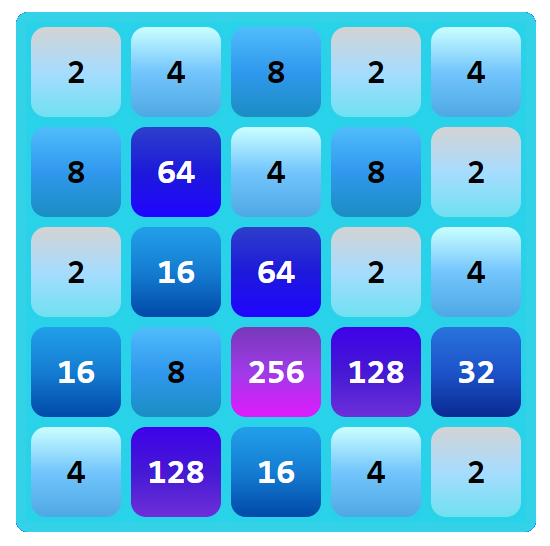

# 8192 GAME
## Desarrollador
Esta adaptación del juego [2048](https://play2048.co) fue desarrollada por José Manuel Pantoja Rosas (Neonwaac).

## Descripción
8192 GAME es una variante del popular juego 2048 donde el objetivo es combinar fichas para alcanzar el valor de casilla 8192. Cada movimiento combina casillas adyacentes con el mismo número, duplicando su valor hasta alcanzar 8192.

## Jugabilidad
Combina casillas moviéndolas en cuatro direcciones: arriba, abajo, izquierda o derecha. Cuando dos casillas con el mismo número se tocan, se fusionan en una. El juego termina cuando no hay más movimientos disponibles o cuando el jugador alcanza el valor de casilla 8192.

## Interfaz de Usuario
La interfaz de usuario presenta una cuadrícula de 5x5 donde se muestran las fichas. Cada ficha representa un número y se puede mover utilizando las teclas de flecha (arriba, abajo, izquierda, derecha). La interfaz está diseñada con simplicidad en mente, enfocándose en la jugabilidad sin distracciones.

## Contacto y Soporte
Contacta a Neonwaac para cualquier consulta o soporte:
- Número de contacto: +573123903681
- Soporte: +573123903681